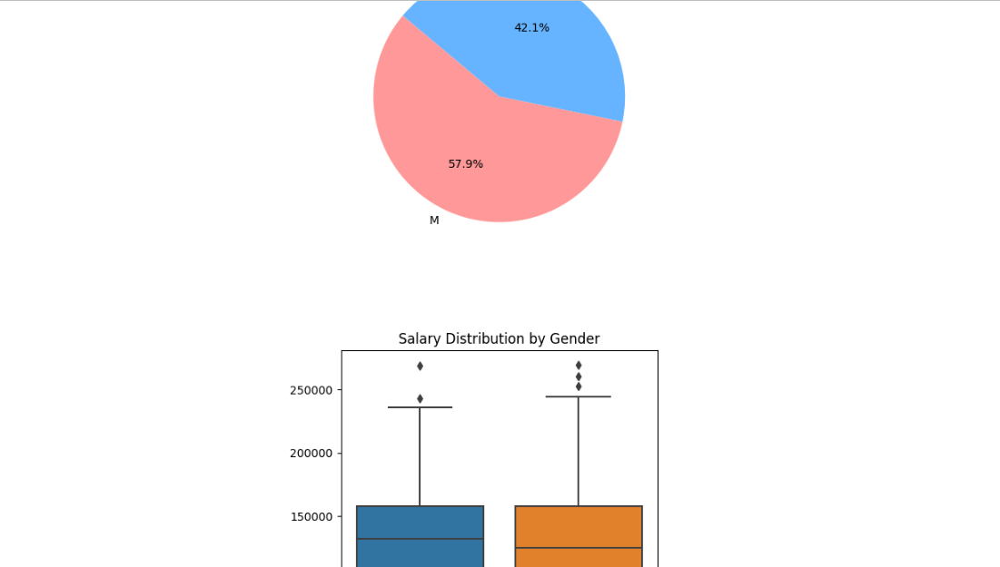

# User-Friendly CSV File Uploader with Data Analysis and Visualization
### This project involves creating a user-friendly web application using Django, where users can upload CSV files. The application provides an intuitive interface to ensure ease of use. After uploading a CSV file, the application performs simple data analysis with the help of Pandas and generates various graphs to visualize the data.

#### Technologies Used: Django, Python, Pandas, Matplotlib, seaborn, HTML+CSS

# Setup Instructions:
## Prerequisites:
1) Python 3.x
2) Django 
3) Virtualenv (optional but recommended)

#### Step 1: Clone the Repository
git clone (https://github.com/Vaibhavpasalkar12/Django_CSV_Import.git)
cd your-repository
#### Step 2: Create and Activate a Virtual Environment (optional but recommended)
python -m venv venv
source venv/bin/activate   # On Windows use `venv\Scripts\activate`
#### Step 3: Install Dependencies
pip install -r requirements.txt
#### Step 4: Apply Migrations
python manage.py migrate
#### Step 5: Create a Superuser (to access Django Admin)
python manage.py createsuperuser
#### Step 6: Run the Development Server
python manage.py runserver . 
Visit http://127.0.0.1:8000/ in your web browser to access the application.
#### Step 7: Access the Admin Interface
Visit http://127.0.0.1:8000/admin in your web browser and log in with the superuser credentials you created earlier.

## Key Features:

### 1) CSV File Upload: Users can upload CSV files through a clean and simple web interface.
### 2) Data Validation: The uploaded CSV files are validated to ensure they are in the correct format.
### 3) Data Analysis: Basic data analysis is performed on the uploaded CSV data using Python's Pandas library.
### 4) Data Visualization: The results of the data analysis are visualized using graphs and charts created with Matplotlib.
### 5) User Interface: The web interface is designed to be user-friendly and accessible, making the data upload and visualization process straightforward for users.

_____________________________________________________________________________________________________________________________________________________________________

### Data Analysis and Visualization: Once a CSV file is uploaded, the application will process the data using Pandas and generate visualizations, such as various graphs, which can be viewed on the same page .

Image/Z1.png

